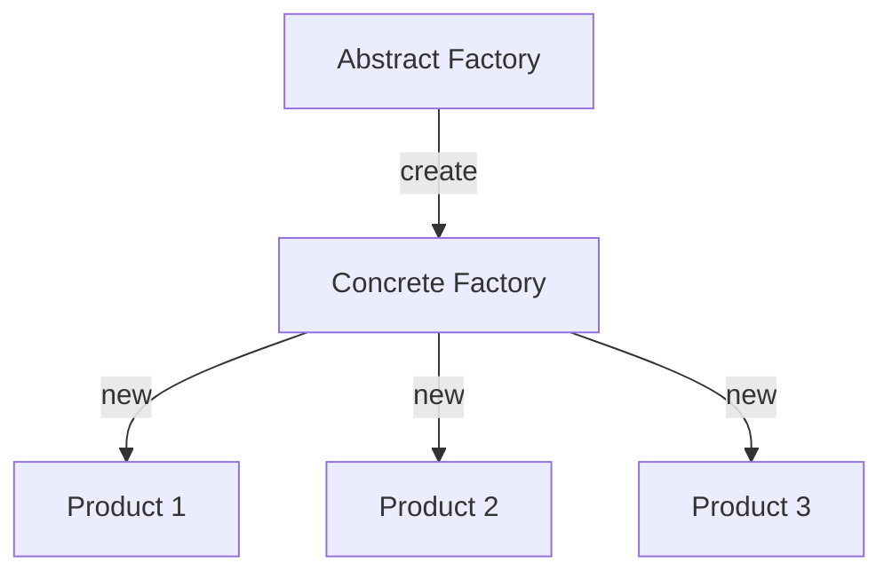

### Abstract Factory <!-- element style="display:none" -->

<split left="1" right="1">

![[abstract-factory.png | 500]](./imgs/abstract-factory.png)

::: block <!-- element style="display: flex; font-size: 2rem" align="center"  -->
- Type: Creational
::: 

</split>

Allows you to create families of related objects without being tied to specific classes of the objects being created.

note: 

Дозволяє створювати сімейства пов'язаних об'єктів, не прив'язуючись до конкретних класів об'єктів, що створюються.

::: block <!-- element style="display: none;" -->

:::

--

#### Abstract factory: example #1

```js [|7-11|13]
class SuccessNotificationFactory {}
class ErrorNotificationFactory {}
class InfoNotificationFactory {}

class NotificationFactory {
  static create (type = '') {
    const notificationTypes = {
      succes: SuccessNotificationFactory,
      error: ErrorNotificationFactory,
      info: InfoNotificationFactory
    };
    
    return notificationTypes[type];
  }
}
```

--

#### Abstract factory: example #1

```js
const SuccessNotificationF = NotificationFactory.create('success');

const success1 = new SuccessNotificationF();
const success2 = new SuccessNotificationF();
const success3 = new SuccessNotificationF();

const ErrorNotificationF = NotificationFactory.create('error');

const error1 = new ErrorNotificationF();
const error1 = new ErrorNotificationF();
```

back: [[master-class/javascript-patterns/JavaScript-Gof-patterns#Abstract Factory]] <!-- element style="display:none" -->
