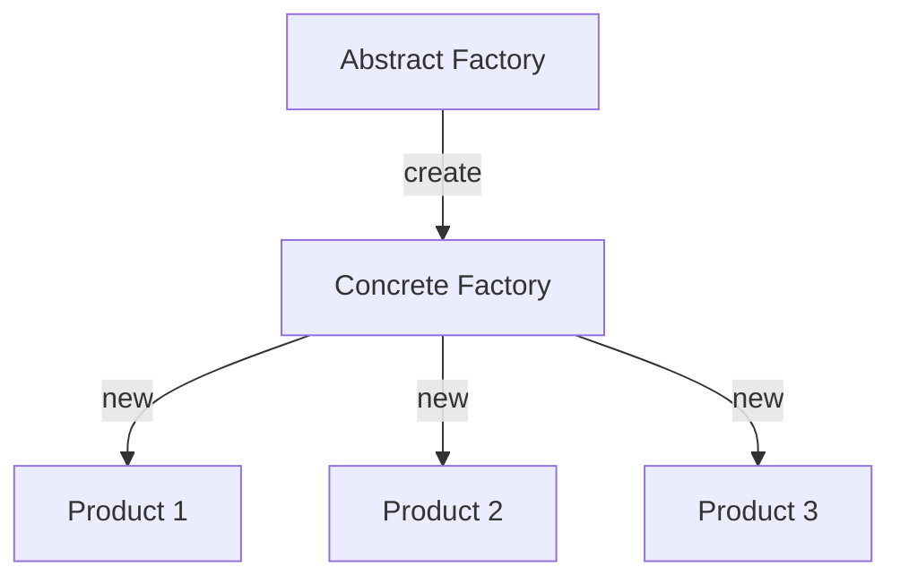

### Abstract Factory <!-- element style="display:none" -->

![[abstract-factory.png | 400]](./imgs/abstract-factory.png)

Позволяет создавать семейства связанных объектов, не привязываясь к конкретным классам создаваемых объектов.

::: block <!-- element style="display: none;" -->

:::

--

#### Abstract factory: example #1

```js
class SuccessNotificationFactory {}
class ErrorNotificationFactory {}
class InfoNotificationFactory {}

class NotificationFactory {
  static create (type = '') {
    const notificationTypes = {
      succes: SuccessNotificationFactory,
      error: ErrorNotificationFactory,
      info: InfoNotificationFactory
    };
    
    return notificationTypes[type];
  }
}
```

--

#### Abstract factory: example #1

```js
const SuccessNotificationF = NotificationFactory.create('success');

const success1 = new SuccessNotificationF();
const success2 = new SuccessNotificationF();
const success3 = new SuccessNotificationF();

const ErrorNotificationF = NotificationFactory.create('error');

const error1 = new ErrorNotificationF();
const error1 = new ErrorNotificationF();
```

back: [[📖 presentation#Abstract Factory]] <!-- element style="display:none" -->
