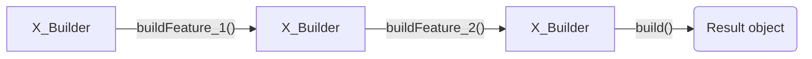

### Builder <!-- element style="display:none" -->


<split left="1" right="1">

![[builder.png | 500]](./imgs/builder.png)

::: block <!-- element style="display: flex; font-size: 2rem" align="center"  -->
- Type: Creational
- Complexity: ⭐⭐⭐
::: 

</split>

Позволяет создавать сложные объекты пошагово.

::: block <!-- element style="display: none;" -->

:::

--

#### Builder: example #1

```js
const request = new PaymentRequest()
  .setSenderName("John Doe")
  .setSenderCardNumber("0000 1111 2222 3333")
  .setSenderCardDate("01/26")
  .setSenderCardCvv("000")
  .setReceiverCardNumber("3333 2222 1111 0000")
  .setReceiverName("Jane Doe")
  .setAmount(100)
  .setApiKey("qwerty")
  .getRequest();

performTransaction(request);
```

--

#### Builder: example #1

```js [|13, 19, 25, 31, 37, 43, 49, 55, 59]
class PaymentRequest {
  constructor() {
    this.request = {
      sender: {},
      receiver: {},
      data: {}
    };
  }

  setSenderCardNumber(cardNumber) {
    this.request.sender.cardNumber = cardNumber;

    return this;
  }

  setSenderCardCvv(cvv) {
    this.request.sender.cvv = cvv;

    return this;
  }

  setSenderCardDate(date) {
    this.request.sender.expireDate = date;

    return this;
  }

  setSenderName(fullName) {
    this.request.sender.name = fullName;

    return this;
  }

  setReceiverCardNumber(cardNumber) {
    this.request.receiver.cardNumber = cardNumber;

    return this;
  }

  setReceiverName(fullName) {
    this.request.receiver.name = fullName;

    return this;
  }

  setApiKey(key) {
    this.request.data.key = key;

    return this;
  }

  setAmount(amount) {
    this.request.data.amount = amount;

    return this;
  }

  getRequest() {
    return this.request;
  }
}
```

back: [[📖 presentation#Builder]] <!-- element style="display:none" -->
