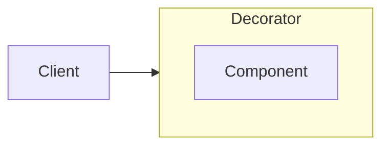

### Decorator <!-- element style="display:none" -->

![[decorator.png | 400]](../imgs/decorator.png)

С помощью "оберток" реализует динамическое расширение функционала используя механизм агрегации или композиции.

::: block <!-- element style="display: none;" -->



:::

--

#### Decorator: example #1
```js
// connect-to-store.js
const globalStore = {};

const connectToStore = Component => class extends Component {
  constructor(...props) {
    props.push(globalStore);

    super(...props);
  }
}

// component.js
class Component {
  constructor(store) {
    this.store = store;
  }
}

export default connectToStore(Component);
```


back: [[📖 presentation#Decorator]] <!-- element style="display:none" -->