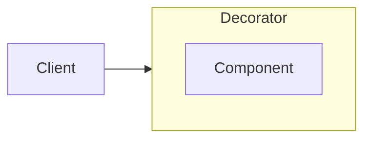

### Decorator <!-- element style="display:none" -->

<split left="1" right="1">

![[decorator.png | 500]](./imgs/decorator.png)

::: block <!-- element style="display: flex; font-size: 2rem" align="center"  -->
- Type: Structural
::: 

</split>

With the help of "wrappers" it implements dynamic expansion of functionality using the mechanism of aggregation or composition.

note:

За допомогою "обгорток" реалізує динамічне розширення функціоналу використовуючи механізм агрегації або композиції.

::: block <!-- element style="display: none;" -->



:::

--

#### Decorator: example #1
```js [|4, 19]
// connect-to-store.js
const globalStore = {};

const connectToStore = Component => class extends Component {
  constructor(...props) {
    props.push(globalStore);

    super(...props);
  }
}

// component.js
class Component {
  constructor(store) {
    this.store = store;
  }
}

export default connectToStore(Component);
```


back: [[master-class/javascript-patterns/JavaScript-Gof-patterns#Decorator]] <!-- element style="display:none" -->
