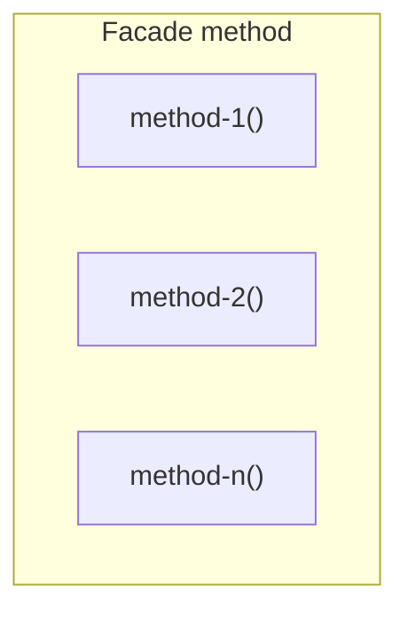

### Facade <!-- element style="display:none" -->

![[facade.png | 400]](./imgs/facade.png)

Предоставляет простой интерфейс к сложной сущности: набору методов класса, библиотеке, фреймворку и т.д.

::: block <!-- element style="display: none;" -->



:::

--

#### Facade: example #1

```js{1, 2-3}
class Component {
  async update () {
    const data = await this.loadData();
    const filteredData = this.filterData(data);
    const sortedData = this.sortData(filteredData);
    
    this.render(sortedData);
  }
  
  async loadData () {/* some implementation */}

  filterData () {/* some implementation */}

  sortData () {/* some implementation */}
}

const component = new Component();

component.update();
```

back: [[📖 presentation#Facade]] <!-- element style="display:none" -->