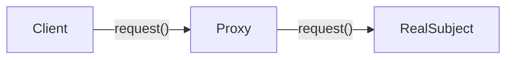

### Proxy <!-- element style="display:none" -->

<split left="1" right="1">

![[proxy.png | 500]](./imgs/proxy.png)

::: block <!-- element style="display: flex; font-size: 2rem" align="center"  -->
- Type: Structural
- Complexity: ⭐⭐⭐
::: 

</split>

Позволяет подставлять вместо реальных объектов специальные объекты-заменители

::: block <!-- element style="display: none;" -->



:::

--

#### Proxy: example #1

```js []
const user = {
  nickname: 'John'
};

const proxyUser = new Proxy(user, {
  get(target, prop, receiver) {
    if (prop in target) {
      return Reflect.get(target, prop, receiver);
    } else {
      throw new ReferenceError(`There is no propery: "${prop}"`)
    }
  }
});

proxyUser.foo // Uncaught ReferenceError: There is no propery: "foo"
```

--

#### Proxy: example #2

```js [| 3, 8, 12, 22| 19, 23-25 | 49]
// request.js
class Proxy {
  proxyCache = new Map();

  constructor(requestObj, {
    maxSize = 10
  } = {}) {
    this.requestObj = requestObj;
    this.maxSize = maxSize;
  }

  set (key = '', value) {
    if (this.proxyCache.size === this.maxSize) {
      const oldestKey = [...this.proxyCache.keys()].shift();

      this.proxyCache.delete(oldestKey);
    }

    this.proxyCache.set(key, value);
  }

  async get (key, options) {
    if (this.proxyCache.has(key)) {
      return this.proxyCache.get(key);
    }
    
    const result = await this.requestObj.get(key, options);

    this.set(key, result);
    
    return result;
  }
}

const httpRequest = {
  async get(url = '', options = {}) {
    try {
      const urlString = url.toString();
      const response = await fetch(urlString, options);
      const result = await response.json();

      return result;
    } catch (error) {
      console.error(`Request error, ${error.message}`);  
    }
  }
};

const proxyHttpRequest = new Proxy(httpRequest, { maxSize: 10 });

proxyHttpRequest.get('url-1'); // Request to server and resposne
proxyHttpRequest.get('url-1'); // Request to cache and response
```

back: [[📖 presentation#Proxy]] <!-- element style="display:none" -->
