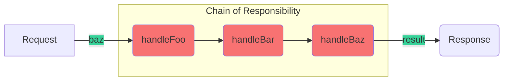

### Chain Of Responsibility <!-- element style="display:none" -->

<split left="1" right="1">

![[chain-of-responsibility.png | 500]](./imgs/chain-of-responsibility.png)

::: block <!-- element style="display: flex; font-size: 2rem" align="center"  -->
- Type: Behavioral
::: 

</split>

Allows you to transmit requests sequentially through a chain of handlers.
Each subsequent handler decides whether it can process the request itself and Is it worth passing the request further down the chain?

note: 

Дозволяє передавати запити послідовно по ланцюжку обробників.
Кожен наступний оброблювач вирішує, чи може він обробити запит сам і чи варто надсилати запит далі по ланцюгу.

::: block <!-- element style="display: none;" -->



:::

--

#### Chain of Responsibility: example #1

```js [|2,10]
class Handler {
  handle(state, action) {
    if (this.nextHandler) {
      return this.nextHandler.handle(state, action);
    }

    return state;
  }

  setNext(handler) {
    this.nextHandler = handler;
  }
}
```

--

#### Chain of Responsibility: example #1

```js
class ProfileHandler extends Handler {
  handle(state, action) {
    if (action.type === "PERSON/UPDATE") {
      return {
        ...state
        // ... add person data
      };
    }

    return super.handle(state, action);
  }
}

class PostsHandler extends Handler {
  handle(state, action) {
    if (action.type === "POSTS/GET") {
      return {
        ...state
        // ... add posts data
      };
    }

    return super.handle(state, action);
  }
}
```

--

#### Chain of Responsibility: example #1

```js [|1-9|11-14|16-18]
const createRootReducer = (handlers = []) => {
  for (const [index, handler] of handlers.entries()) {
    handler.setNext(handlers[index + 1]);
  }

  const [firstHandler] = handlers;

  return firstHandler;
};

const rootReducer = createRootReducer([
  new ProfileHandler(),
  new PostsHandler()
]);

console.log(rootReducer.handle({}, { type: "UNHANDLED" }));
console.log(rootReducer.handle({}, { type: "PERSON/UPDATE" }));
console.log(rootReducer.handle({}, { type: "POSTS/GET" }));
```

back: [[master-class/javascript-patterns/JavaScript-Gof-patterns#Chain of Responsibility]] <!-- element style="display:none" -->
