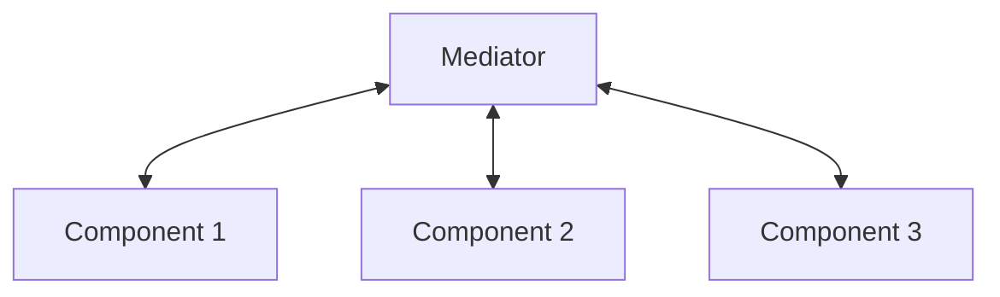

### Mediator <!-- element style="display:none" -->

<split left="1" right="1">

![[mediator.png | 400]](./imgs/mediator.png)

::: block <!-- element style="display: flex; font-size: 2rem" align="center"  -->
- Type: Behavioral
::: 

</split>

Allows you to reduce the coupling of many classes among themselves by moving these connections into one intermediary class.

note:

Дозволяє зменшити пов'язаність безлічі класів між собою завдяки переміщенню цих зв'язків в один клас-посередник.

::: block <!-- element style="display: none;" -->



:::

--

#### Mediator: example #1

```js
  const chatroom = new ChatRoom();

  const john = new User("John", chatroom);
  const peter = new User("Peter", chatroom);

  john.send(peter, "Some message");
  peter.send(john, "Hey! New one message");
```

--

#### Mediator: example #1

```js
class ChatRoom {
  users = [];

  subscribe (user) {
    this.users.push(user);

    return () => {
      this.users.filter(item => item !== user);
    }
  }

  getName() {
    return ChatRoom.name;
  }

  broadcast (message = '') {
    for (const user of this.users) {
      this.send(this, user, message);
    }
  }

  send (sender, receiver, message = '') {
    const senderName = sender.getName();
    const formattedMsg = `${new Date().toLocaleString()} [${senderName}]: ${message}`;

    receiver.receiveMessage(formattedMsg);
  }
}

class User {
  constructor(name, chatroom) {
    this.name = name;
    this.chatroom = chatroom;
  }

  getName() {
    return this.name;
  }

  send(receiver, message = '') {
    this.chatroom.send(this, receiver, message);
  }

  receiveMessage (message = '') {
    console.log(message);
  }
}

const chatroom = new ChatRoom();

const john = new User("John", chatroom);
const peter = new User("Peter", chatroom);

chatroom.subscribe(john);
chatroom.subscribe(peter);

john.send(peter, "Some message");
peter.send(john, "Hey! New one message");

chatroom.broadcast('hi all');
```

back: [[master-class/javascript-patterns/JavaScript-Gof-patterns#Mediator]] <!-- element style="display:none" -->
