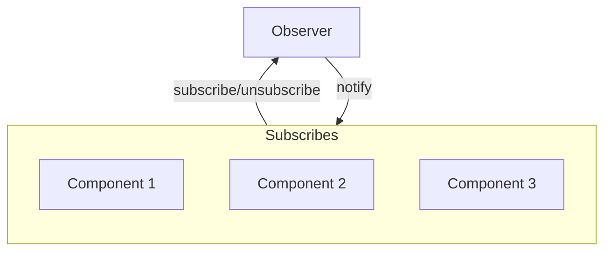

### Observer <!-- element style="display:none" -->

<split left="1" right="1">

![[observer.png | 500]](./imgs/observer.png)

::: block <!-- element style="display: flex; font-size: 2rem" align="center"  -->
- Type: Behavioral
::: 

</split>

Allows you to create a subscription mechanism that will allow some entities to monitor and respond to events occurring in other entities, as a result providing loose coupling.

note:

Дозволяє створити механізм підписки, який дозволить деяким сутностям стежити та реагувати на події, що відбуваються в інших сутностях, як наслідок забезпечуючи слабку пов'язаність.

::: block <!-- element style="display: none;" -->



:::

--

#### Observer: code example #1

```js
class Observable {
  constructor() {
    this.observers = [];
  }

  subscribe(callback) {
    this.observers.push(callback);
  }

  unsubscribe(callback) {
    this.observers = this.observers.filter(observer => observer !== callback);
  }

  notify(data) {
    this.observers.forEach(observer => observer(data));
  }
}
```
