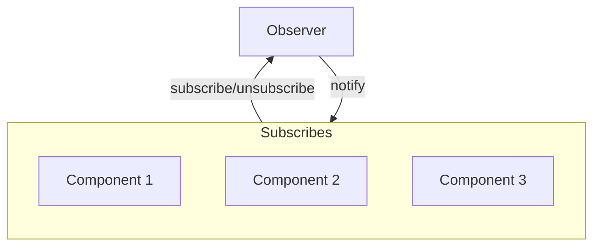

### Observer <!-- element style="display:none" -->

<split left="1" right="1">

![[observer.png | 500]](./imgs/observer.png)

::: block <!-- element style="display: flex; font-size: 2rem" align="center"  -->
- Type: Behavioral
- Complexity: ⭐⭐⭐
::: 

</split>

Позволяет создать механизм подписки, который позволит некоторым сущностям следить и реагировать на события, происходящие в других сущностях, как следствие обеспечивая слабую связанность.

::: block <!-- element style="display: none;" -->



:::

--

#### Observer: code example #1

```js
class Observable {
  constructor() {
    this.observers = [];
  }

  subscribe(callback) {
    this.observers.push(callback);
  }

  unsubscribe(callback) {
    this.observers = this.observers.filter(observer => observer !== callback);
  }

  notify(data) {
    this.observers.forEach(observer => observer(data));
  }
}
```
