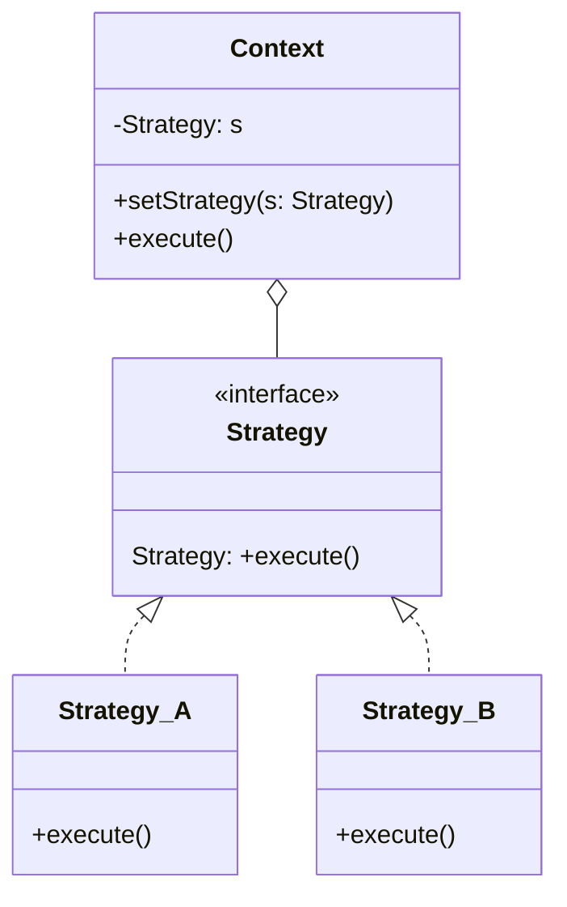

### Strategy <!-- element style="display:none" -->

<split left="1" right="1">

![[strategy.png | 500]](./imgs/strategy.png)

::: block <!-- element style="display: flex; font-size: 2rem" align="center"  -->
- Type: Behavioral
- Complexity: ⭐⭐⭐
::: 

</split>

Определяет семейство схожих алгоритмов, после чего алгоритмы можно взаимозаменять прямо во время исполнения программы

::: block <!-- element style="display: none;" -->



:::

--

#### Strategy: example #1

What can be improved in Table implementation?

```js
class Table {
  constructor(data, options = {}) {
    this.data = data;
    this.sortType = options.sortType;
  }

  sort (callback) {
    if (this.sortType === 'client') {
      const sortedData = [...this.data].sort((a, b) => a - b);
      callback(sortedData);
    }

    if (this.sortType === 'server') {
      fetch('https://api.some-server.com/get-sorted-data')
        .then(response => response.json())
        .then(data => callback(data));
    }
  }
}
```

--

#### Strategy: example #1

```js
class SortOnClientStrategy {
  sort (data, callback) {
    const sortedData = [...data].sort((a, b) => {
      return a - b;
    });

    callback(sortedData);
  }
}

class SortOnServerStrategy {
  sort (data, callback) {
    fetch('https://api.some-server.com/get-sorted-data')
      .then(response => response.json())
      .then(data => callback(data));
  }
}

class Table {
  constructor(data, strategy) {
    this.data = data;
    this.strategy = strategy;
  }

  sort () {
    this.strategy.sort(this.data, sortedData => {
      console.error(sortedData);
    });
  }
}

const table = new Table([], new SortOnServerStrategy());
```

--

#### Strategy: example #2

```js
class BankTransfer {
  execute(data) {
    // call bancking api
  }
}

class PaypalTransfer {
  execute(data) {
    // call PayPal api
  }
}

class CryptoTransfer {
  execute(data) {
    // call crypto wallet api
  }
}
```

--

#### Strategy: example #2

```js
class Transfer {
  setStrategy(strategy) {
    this.tranferStrategy = strategy;
  }

  execute(data) {
    this.tranferStrategy.execute(data);
  }
}
```

--

#### Strategy: example #2

```js
// e.g. input values from form
const transferData = {
  cardNumber: '0000 0000 0000 0000',
  cvv: '000',
  name: 'John Doe'
};

// e.g. value received from dropdown
const transferType = 'bank'; 
const transfer = new Transfer();

if (transferType === 'bank') {
  transfer.setStrategy(new BankTransfer())
} else if (transferType === 'paypal') {
  transfer.setStrategy(new PaypalTransfer())
} else if (transferType === 'crypto') {
  transfer.setStrategy(new CryptoTransfer())
}

transfer.execute(transferData)
```

--

#### Strategy: example #3

How to improve?

```js
class Table {
  constructor(data, options = {}) {
    this.data = data;
    this.sortType = options.sortType;
  }

  sort (callback) {
    if (this.sortType === 'client') {
      const sortedData = [...this.data].sort((a, b) => a - b);

      callback(sortedData);
    }

    if (this.sortType === 'server') {
      fetch('https://api.some-server.com/get-sorted-data')
        .then(response => response.json())
        .then(data => callback(data));
    }
  }
}

const clientSortingTable = new Table([], { sortType: 'client' });
```

--

#### Strategy: example #3

```js
class SortOnClientStrategy {
  sort (data, callback) {
    const sortedData = [...data].sort((a, b) => {
      return a - b;
    });

    callback(sortedData);
  }
}

class SortOnServerStrategy {
  sort (data, callback) {
    fetch('https://api.some-server.com/get-sorted-data')
      .then(response => response.json())
      .then(data => callback(data));
  }
}
```

--

#### Strategy: example #3

```js
import SortOnClientStrategy from "./client-strategy.js";
import SortOnServerStrategy from "./server-strategy.js";

class Table {
  constructor(data, strategy) {
    this.data = data;
    this.strategy = strategy;
  }

  sort () {
    this.strategy.sort(this.data, sortedData => {
      console.error(sortedData);
    });
  }
}

const clientSortingTable = new Table([], new SortOnClientStrategy());
const serverSortingTable = new Table([], new SortOnServerStrategy());
```

back: [[📖 presentation#Strategy]] <!-- element style="display:none" -->
