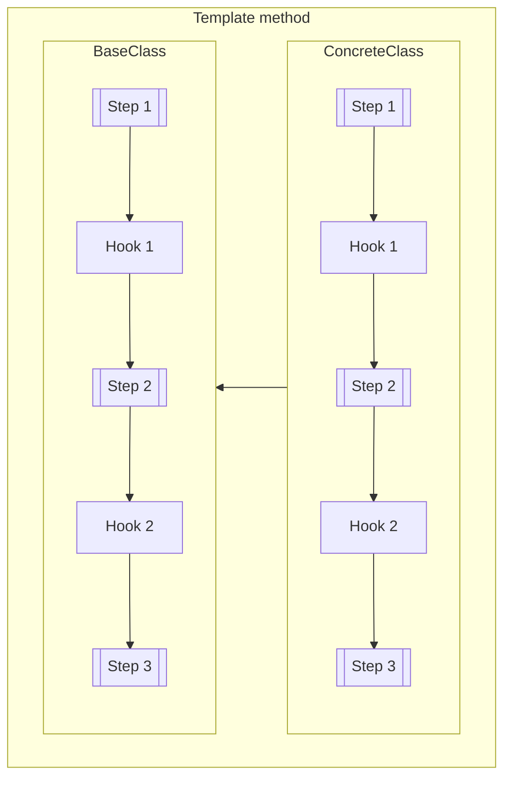

### Template Method <!-- element style="display:none" -->

<split left="1" right="1">

![[template-method.png | 500]](./imgs/template-method.png)

::: block <!-- element style="display: flex; font-size: 2rem" align="center"  -->
- Type: Behavioral
- Complexity: ⭐⭐⭐
::: 

</split>

Определяет скелет алгоритма, перекладывая ответственность за некоторые его шаги 
на подклаcсы или методы

::: block <!-- element style="display: none;" -->



:::
 
--

#### Template Method: example #1

```js
class BaseComponent {
  constructor() {
    this.templateMethod();
  }

  templateMethod () {
    this.beforeRenderHook();
    this.render();
    this.afterRenderHook();
    this.initEventListeners();
    this.afterInitializationHook();
  }

  beforeRenderHook () {
    // This is hook method
  }

  render () {
    // Some basic implementation
  }

  afterRenderHook () {
    // This is hook method
  }

  initEventListeners () {
    // Some basic implementation
  }

  afterInitializationHook () {
    // This is hook method
  }
}
```

--

#### Template Method: example #1

```js
class Component extends BaseComponent {
  beforeRenderHook () {
    console.log(`This hook will be run before render method`);
  }

  afterRenderHook () {
    console.log(`This hook will be run after render method`);
  }

  initEventListeners () {
    super.initEventListeners();
    // Here we can add extra listeners
  }
}
```
