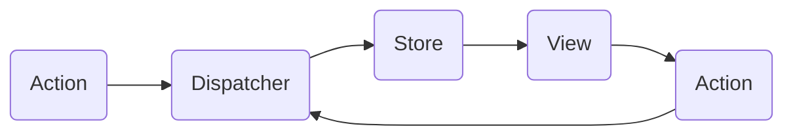

### Flux <!-- element style="display:none" -->

<split left="1" right="1">

![[flux.png | 500]](./imgs/flux.png)

::: block <!-- element style="display: flex; font-size: 2rem" align="center"  -->

- Type: Architectural
- Complexity: ⭐⭐⭐
  :::

</split>

Allows to have a single store for components` data with an easy way to access it and modify

::: block <!-- element style="display: none;" -->



:::

--

#### Flux: pattern example

```js
// Dispatcher: Responsible for dispatching actions to stores
class Dispatcher {
  constructor() {
    this.subscribers = [];
  }

  // Register a store action handler
  subscribe(subscriber) {
    this.subscribers.push(subscriber);
  }

  // Invoke an action handler in each store
  dispatch(action) {
    this.subscribers.forEach((subscriber) => subscriber(action));
  }
}

// Store: Manages the application state and handles actions
class CounterStore {
  constructor(dispatcher) {
    this.dispatcher = dispatcher;
    this.counter = 0;

    // Register a callback to handle actions
    this.dispatcher.subscribe(this.handleAction.bind(this));
  }

  // Action handler
  handleAction(action) {
    switch (action.type) {
      case "INCREMENT":
        this.counter++;
        this.emitChange();
        break;
      case "DECREMENT":
        this.counter--;
        this.emitChange();
        break;
      default:
      // No-op for unhandled actions
    }
  }

  // Method to get the current state
  getState() {
    return this.counter;
  }

  // Notify subscribers (views) that the state has changed
  emitChange() {
    console.log(`State changed: ${this.counter}`);
  }
}

// View: Displays the state and interacts with the user
class CounterView {
  constructor(store, dispatcher) {
    this.store = store;
    this.dispatcher = dispatcher;

    // Register a callback to update the view when the state changes
    this.store.emitChange = this.update.bind(this);

    // Attach event handlers for UI interactions
    // document
    //   .getElementById("incrementBtn")
    //   .addEventListener("click", this.increment.bind(this));
    // document
    //   .getElementById("decrementBtn")
    //   .addEventListener("click", this.decrement.bind(this));

    // Initialize the view with the initial state
    this.update();
  }

  // Update the view with the current state
  update() {
    const counter = this.store.getState();
    console.log(`Counter: ${counter}`);
    // Attach a UI interaction here
    // document.getElementById(
    //   "counterDisplay"
    // ).textContent = `Counter: ${counter}`;
  }

  // Action creators for UI interactions
  increment() {
    this.dispatcher.dispatch({ type: "INCREMENT" });
  }

  decrement() {
    this.dispatcher.dispatch({ type: "DECREMENT" });
  }
}

// Create instances of the Dispatcher, Store, and View.
const dispatcher = new Dispatcher();
const counterStore = new CounterStore(dispatcher);
const counterView = new CounterView(counterStore, dispatcher);
```

#### Flux: usage example

```js
console.log(counterStore.getState()); // 0
counterView.increment();
console.log(counterStore.getState()); // 1
counterView.increment();
counterView.increment();
counterView.increment();
counterView.increment();
console.log(counterStore.getState()); // 5
counterView.decrement();
console.log(counterStore.getState()); // 4
```

back: [[📖 presentation#Flux]] <!-- element style="display:none" -->
