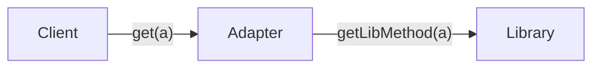

# Adapter




For example, we have a class that works with some maps service to calc the shipping price:

```js
class ShippingCalculator {
  constructor(mapService) {
    this.mapService = mapService;
  }

  getPrice(from, to, weight) {
    const startLocation = this.mapService.getLocation(from);
    const finishLocation = this.mapService.getLocation(to);
    const distance = this.mapService.getDistance(startLocation, finishLocation);

    return (distance * weight) / 100;
  }
}
```
And it worked well, untill we decided to use the new maps service with incompatible interface, for example Google Maps:

```js
class GoogleMaps {
  coordsByAddress(address) {
    return [55.92312, -12.13123];
  }

  calcDistance(from, to) {
    return 378;
  }
}

class GoogleMapsShippingAdapter {
  constructor() {
    this.map = new GoogleMaps();
  }

  getLocation(address) {
    const coords = this.map.coordsByAddress(address);

    return {
      lat: coords[0],
      lng: coords[1]
    };
  }

  getDistance(from, to) {
    const distance = this.map.calcDistance(
      [from.lat, from.lng],
      [to.lat, to.lng]
    );

    return distance;
  }
}

const shipping = new ShippingCalculator(new GoogleMapsShippingAdapter());
```