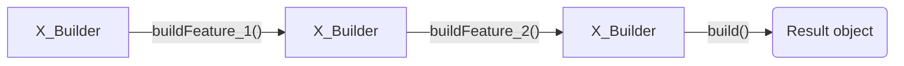

# Builder




For example, if you are working on implementation of flow for building some complicated object, it may be a good place to use the Builder pattern, because its main purpose is to simplify creating of similar objects but with different configurations. In the code example below you can see how it could be implemented for creating object for performing payment transaction, as it may contain a lot of fields:

Interfaces:

```js
class PaymentRequest {
  constructor() {
    this.request = {
      sender: {},
      receiver: {},
      data: {}
    };
  }

  setSenderCardNumber(cardNumber) {
    this.request.sender.cardNumber = cardNumber;

    return this;
  }

  setSenderCardCvv(cvv) {
    this.request.sender.cvv = cvv;

    return this;
  }

  setSenderCardDate(date) {
    this.request.sender.expireDate = date;

    return this;
  }

  setSenderName(fullName) {
    this.request.sender.name = fullName;

    return this;
  }

  setReceiverCardNumber(cardNumber) {
    this.request.receiver.cardNumber = cardNumber;

    return this;
  }

  setReceiverName(fullName) {
    this.request.receiver.name = fullName;

    return this;
  }

  setApiKey(key) {
    this.request.data.key = key;

    return this;
  }

  setAmount(amount) {
    this.request.data.amount = amount;

    return this;
  }

  getRequest() {
    return this.request;
  }
}

const request = new PaymentRequest()
  .setSenderName("John Doe")
  .setSenderCardNumber("0000 1111 2222 3333")
  .setSenderCardDate("01/26")
  .setSenderCardCvv("000")
  .setReceiverCardNumber("3333 2222 1111 0000")
  .setReceiverName("Jane Doe")
  .setAmount(100)
  .setApiKey("qwerty")
  .getRequest();

SomePaymentService.performTransaction(request);
```
