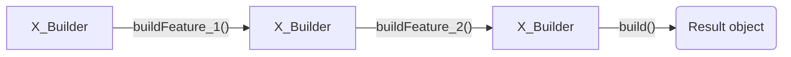

# Abstract Factory



For example, if you are working on implemnetation of flow for building some complicated object, it may be a good place to use the Builder pattern, because its main purpose is to simplify creating of similar objects but with different configurations. In the code example below you can see how it could be implemented for ordering custom mirrors:

Interfaces:

```js
interface IHole {
  x: number;
  y: number;
  radius: number;
}

type TCornerPosition =
  | "all"
  | "top-left"
  | "top-right"
  | "bottom-left"
  | "bottom-right";

interface ICorner {
  position: TCornerPosition;
  radius: number;
}

interface MirrorSpecification {
  width: number;
  height: number;
  thickness: number;
  holes: IHole[];
  beveled: boolean;
  corners: ICorner[];
}
```

Implementation
```js
class CustomMirrorBuilder {
  private specification: MirrorSpecification;

  constructor() {
    this.specification = {
      width: 0,
      height: 0,
      thickness: 0,
      beveled: false,
      holes: [],
      corners: []
    };
  }

  setWidth(width: number) {
    this.specification.width = width;

    return this;
  }

  setHeight(height: number) {
    this.specification.height = height;

    return this;
  }

  setThickness(thickness: number) {
    this.specification.thickness = thickness;

    return this;
  }

  setBevelness(beveled: boolean) {
    this.specification.beveled = beveled;

    return this;
  }

  addHole(x: number, y: number, radius: number) {
    this.specification.holes.push({
      x,
      y,
      radius
    });

    return this;
  }

  setCorner(position: TCornerPosition, radius: number) {
    if (position === "all") {
      this.specification.corners = [{ position, radius }];
    } else {
      this.specification.corners.push({ position, radius });
    }

    return this;
  }

  reset() {
    this.specification = {
      width: 0,
      height: 0,
      thickness: 0,
      beveled: false,
      holes: [],
      corners: []
    };

    return this;
  }

  getResult() {
    if (
      !this.specification.width ||
      !this.specification.height ||
      !this.specification.thickness
    ) {
      throw new Error("Width, height and thickness cannot be 0");
    }

    return this.specification;
  }
}
```
Usage example

```js
const builder = new CustomMirrorBuilder();

const squareMirror = builder
  .setWidth(10)
  .setHeight(10)
  .setThickness(1)
  .getResult();

const circleMirror = builder
  .reset()
  .setWidth(10)
  .setHeight(10)
  .setThickness(1)
  .setCorner("all", 5)
  .getResult();
  
const mirrorWithCircle = builder
  .reset()
  .setWidth(10)
  .setHeight(10)
  .setThickness(1)
  .addHole(5, 5, 2)
  .getResult();
```
