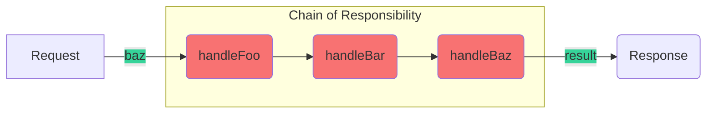

# Chain Of Responsibility




With this pattern you can implement some sort of redux reducer. You don't know which exactly reducer will handle your action, so just let the rootReducer to pass the action to all of them, and only the right one will handle it.

Implementation example:

```js
class Handler {
  handle(state, action) {
    if (this.nextHandler) {
      return this.nextHandler.handle(state, action);
    }

    return state;
  }

  setNext(handler) {
    this.nextHandler = handler;
  }
}

class ProfileHandler extends Handler {
  handle(state, action) {
    if (action.type === "PERSON/UPDATE") {
      return {
        ...state
        // ... add person data
      };
    }

    return super.handle(state, action);
  }
}

class PostsHandler extends Handler {
  handle(state, action) {
    if (action.type === "POSTS/GET") {
      return {
        ...state
        // ... add posts data
      };
    }

    return super.handle(state, action);
  }
}
```

Usage example:
```js
const createRootReducer = (handlers = []) => {
  handlers.forEach((handler, index, arr) => {
    if (index < arr.length) {
      handler.setNext(arr[index + 1]);
    }
  });

  return handlers[0];
};

const rootReducer = createRootReducer([
  new ProfileHandler(),
  new PostsHandler()
]);

console.log(rootReducer.handle({}, { type: "UNHANDLED" }));
console.log(rootReducer.handle({}, { type: "PERSON/UPDATE" }));
console.log(rootReducer.handle({}, { type: "POSTS/GET" }));
```
