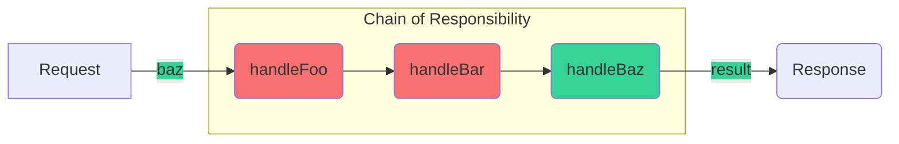

# Chain Of Responsibility




With this pattern you can implement some sort of redux reducer. You don't know which exactly reducer will handle your action, so just let the rootReducer to pass the action to all of them, and only the right one will handle it.

Implementation example:

```js
class Handler {
  handle(state, action) {
    if (this.nextHandler) {
      return this.nextHandler.handle(state, action);
    }

    return state;
  }

  setNext(handler) {
    this.nextHandler = handler;
  }
}

class ProfileHandler extends Handler {
  handle(state, action) {
    if (action.type === "PERSON/UPDATE") {
      return {
        ...state
        // ... add person data
      };
    }

    return super.handle(state, action);
  }
}

class PostsHandler extends Handler {
  handle(state, action) {
    if (action.type === "POSTS/GET") {
      return {
        ...state
        // ... add posts data
      };
    }

    return super.handle(state, action);
  }
}
```

Usage example:
```js
const createRootReducer = (handlers = []) => {
  handlers.forEach((handler, index, arr) => {
    if (index < arr.length) {
      handler.setNext(arr[index + 1]);
    }
  });

  return handlers[0];
};

const rootReducer = createRootReducer([
  new ProfileHandler(),
  new PostsHandler()
]);

console.log(rootReducer.handle({}, { type: "UNHANDLED" }));
console.log(rootReducer.handle({}, { type: "PERSON/UPDATE" }));
console.log(rootReducer.handle({}, { type: "POSTS/GET" }));
```
---
## Form Validation Example

```js
class Validator {
  validate(form, errors) {
    if (this.nextHandler) {
      return this.nextHandler.validate(form, errors);
    }

    return errors;
  }

  isValid(fieldValue, regex) {
    if (fieldValue === undefined || regex.test(fieldValue)) {
      return true;
    }

    return false;
  }

  setNext(handler) {
    this.nextHandler = handler;
  }
}

class EmailValidator extends Validator {
  validate(form, errors = {}) {
    const regex = /^[^\s@]+@[^\s@]+\.[^\s@]+$/;

    if (!super.isValid(form.email, regex)) {
      errors.email = "Email is not valid";
    }

    return super.validate(form, errors);
  }
}

class CardNumberValidator extends Validator {
  validate(form, errors = {}) {
    const regex = /^[0-9]{15,19}$/;
    const value = form.cardNumber.replace(/\s/g, "");

    if (!super.isValid(value, regex)) {
      errors.cardNumber = "Card number is not valid";
    }

    return super.validate(form, errors);
  }
}

class CvvValidator extends Validator {
  validate(form, errors = {}) {
    const regex = /^[0-9]{3,4}$/;

    if (!super.isValid(form.cvv, regex)) {
      errors.cvv = "Card's CVV code is not valid";
    }

    return super.validate(form, errors);
  }
}
```

usage example:
```js
const chainValidators = (validators = []) => {
  validators.forEach((handler, index, arr) => {
    if (index < arr.length) {
      handler.setNext(arr[index + 1]);
    }
  });

  return validators[0];
};

const validators = chainValidators([
  new EmailValidator(),
  new CardNumberValidator(),
  new CvvValidator()
]);

console.log(
  validators.validate({
    email: "hello.world@gmail.com",
    cardNumber: "1234 5647 8443 5434",
    cvv: "1233"
  })
);
```