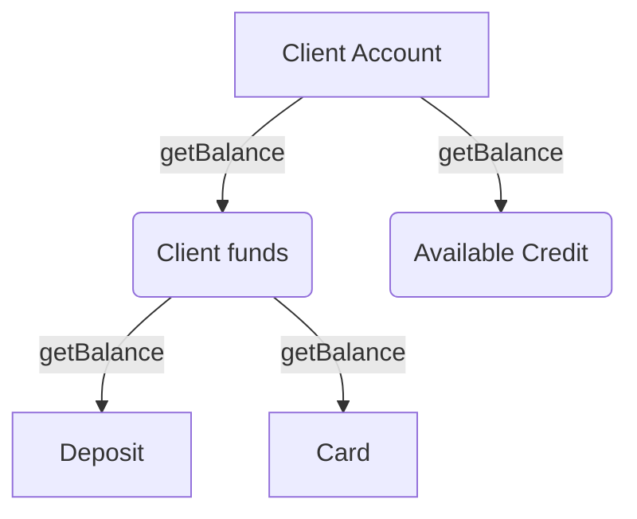

# Composite



The main purpose of the Composite pattern is to let you work with all nodes of the tree-like structure via common interface.

## Implementation example:
```js
class Menu {
  constructor() {
    this.items = [];
  }

  addItem(item) {
    this.items.push(item);
  }
}

class MainMenu extends Menu {
  build() {
    let menu = `
        <ul class="main-menu">
          ${this.items.reduce((result, item) => {
            return (result += item.getHtml());
          }, "")}
        </ul>
    `;

    return menu;
  }
}

class NestedMenu extends Menu {
  constructor(title) {
    super();
    this.title = title;
  }

  getHtml() {
    let menu = `
      <li class="menu-item">
        <a href="#">${this.title}</a>
        <ul class="sub-menu">
          ${this.items.reduce((result, item) => {
            return (result += item.getHtml());
          }, "")}
        </ul>
      </li>
    `;

    return menu;
  }
}

class MenuItem {
  constructor(title) {
    this.title = title;
  }

  getHtml() {
    return `
      <li class="menu-item">
        <a href="#">${this.title}</a>
      </li>
    `;
  }
}
```
---
## Usage example:
```js
const mainMenu = new MainMenu();

// Home
mainMenu.addItem(new MenuItem("Home"));

// About
const about = new NestedMenu("About");
about.addItem(new MenuItem("Personal Info"));
about.addItem(new MenuItem("Career"));
mainMenu.addItem(about);

// Docs
const docs = new NestedMenu("Docs");
const secretDocs = new NestedMenu("Secret Docs");

docs.addItem(secretDocs);
docs.addItem(new MenuItem("Public Docs"));

secretDocs.addItem(new MenuItem("Doc X"));
secretDocs.addItem(new MenuItem("Doc Y"));

mainMenu.addItem(docs);

console.log(mainMenu.build());
```

## Result 
```html
<ul class="main-menu">
   <li class="menu-item">
      <a href="#">Home</a>
   </li>
   <li class="menu-item">
      <a href="#">About</a>
      <ul class="sub-menu">
         <li class="menu-item">
            <a href="#">Personal Info</a>
         </li>
         <li class="menu-item">
            <a href="#">Career</a>
         </li>
      </ul>
   </li>
   <li class="menu-item">
      <a href="#">Docs</a>
      <ul class="sub-menu">
         <li class="menu-item">
            <a href="#">Secret Docs</a>
            <ul class="sub-menu">
               <li class="menu-item">
                  <a href="#">Doc X</a>
               </li>
               <li class="menu-item">
                  <a href="#">Doc Y</a>
               </li>
            </ul>
         </li>
         <li class="menu-item">
            <a href="#">Public Docs</a>
         </li>
      </ul>
   </li>
</ul>
```
