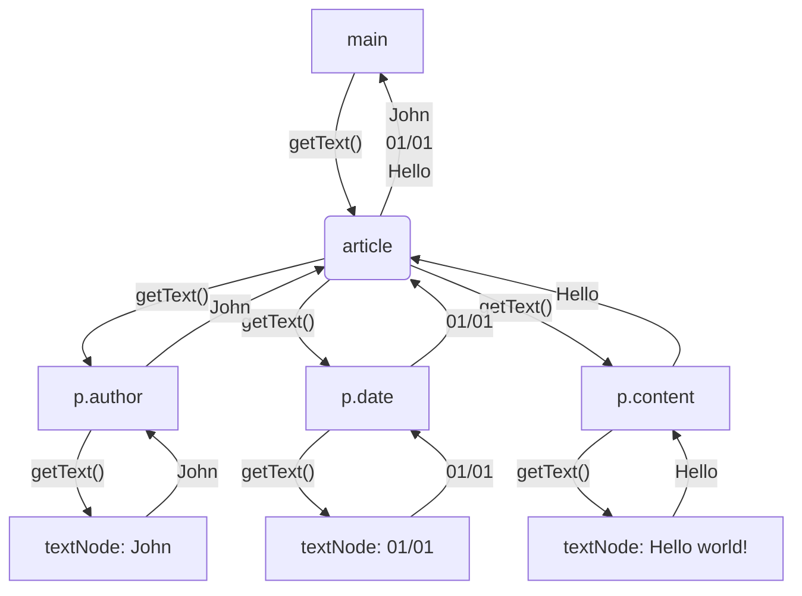

# Composite



Implementation example:

```js
interface INode {
  getNumberOfChildren: () => number;
}

class Span implements INode {
  getNumberOfChildren() {
    return 0;
  }
}

class Div implements INode {
  protected nodes: INode[] = [];

  addNode(child: INode) {
    this.nodes.push(child);
  }

  getNode(index: number) {
    return this.nodes[index]
  }

  getNumberOfChildren() {
    return this.nodes.reduce((amount, child) => {
      return amount + child.getNumberOfChildren();
    }, this.nodes.length);
  }
}
```
Usage example:

```js
const div = new Div();
const users = new Div();

for (let i = 0; i < 50; i++) {
  const user = new Div();
  user.addNode(new Span());
  user.addNode(new Span());

  users.addNode(user);
}

div.addNode(new Div());
div.addNode(users);

console.log(div.getNumberOfChildren());
console.log(div.getNode(0).getNumberOfChildren()); // we don't care whether the received node is "leaf" or "branch"
console.log(div.getNode(1).getNumberOfChildren()); // because they implement the same interface
```
