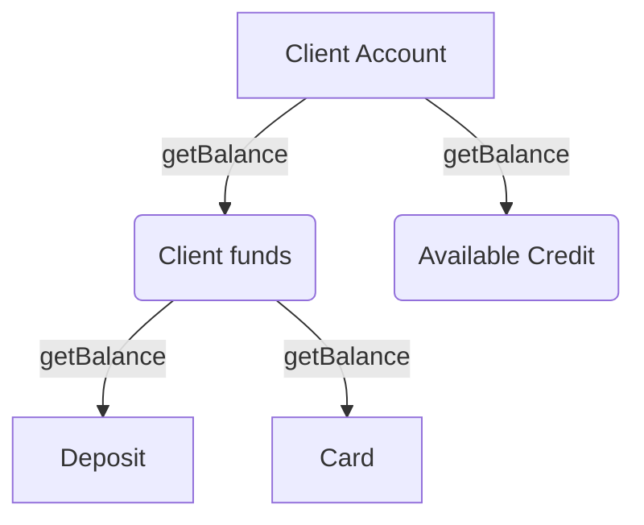

# Composite



The main purpose of the Composite pattern is to let you work with all nodes of the tree-like structure via common interface.

In the example below both `Router` and `Route` implements the `render` method. We can update the example, to let the `Router` have nested `Router`s inside, but it still will follow the same interface and we still will be able to call `render` method and the node will render itself and its children.

Example:

```js
class Router {
  constructor() {
    this.routes = [];
  }

  addRoute(route) {
    this.routes.push(route);
  }

  setCurrentPath(path) {
    this.currentPath = path;
  }

  render() {
    const route = this.routes.find(
      (route) => this.currentPath === route.getPath()
    );

    if (route) {
      route.render();
    } else {
      console.log("No route matched");
    }
  }
}

class Route {
  constructor(path, component) {
    this.path = path;
    this.component = component;
  }

  getPath() {
    return this.path;
  }

  render() {
    this.component.render();
  }
}

const router = new Router();
const homeRoute = new Route("/home", {
  render: () => {
    console.log("Home");
  }
});
const aboutRoute = new Route("/about", {
  render: () => {
    console.log("About");
  }
});

router.addRoute(homeRoute);
router.addRoute(aboutRoute);

router.render();
```
