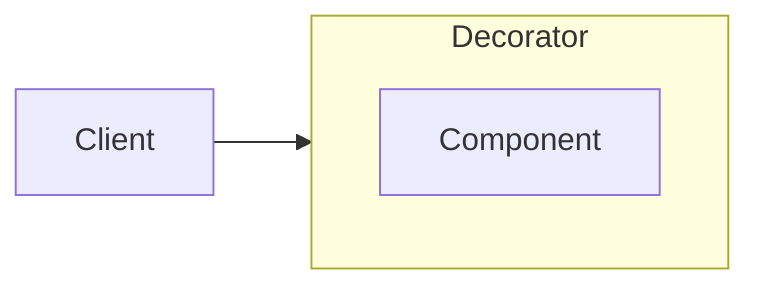

# Decorator



The decorator pattern lets you wrap the target object and enhance it by adding new features. As decorator implements the same interface as the target object, you can wrap as many decorators one inside another as you need.

Implementation example:

```js
class ListItem {
  constructor(title) {
    this.title = title;
  }

  render() {
    // render item
  }
}

class DismissableWrapper {
  constructor(wrapped, onDismiss) {
    this.wrapped = wrapped;
    this.onDismiss = onDismiss.bind(this);
  }

  handleTouchMove() {
    // if dismissed then call this.onDismiss
  }

  render() {
    return (
      <div onTouchMove={this.handleTouchMove}>
        {this.wrapped.render()}
      </div>
    );
  }
}

const notificationsList = data.map((item) => (
  new DismissableWrapper(new ListItem(item.title), () => {
    // handle action, e.g. with api call
  })
))
```
