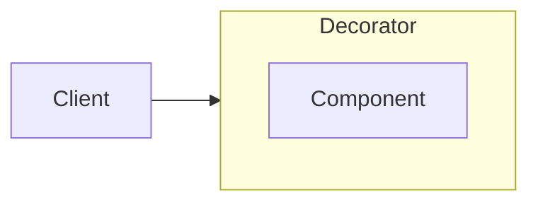

# Decorator



```js
// connect-to-store.js
const globalStore = {};

const connectToStore = Component => class extends Component {
  constructor(...props) {
    props.push(globalStore);

    super(...props);
  }
}

// component.js
class Component {
  constructor(store) {
    this.store = store;
  }
}

export default connectToStore(Component);
```
