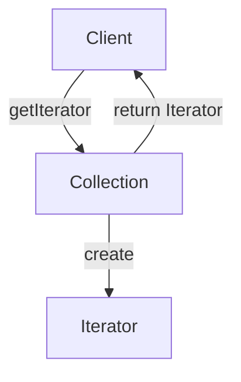

# Iterator


Iterator pattern could be used when we have complex data structure; when we want to have custom iteration approach; when we don't want to expose the data structure to external code.

---
**Note**: the method `[Symbol.iterator]()` is named in this way, to make it possible to use `for...of` loop. If you are not going to traverse over your collection with this loop, then you can name the method, as you wish (e.g. `getIterator()`)

---
```js
class Feed {
  constructor(array) {
    const { ids, values } = this.normalizeArray(array);

    this.feed = values;
    this.feedIds = ids;
  }

  get(id) {
    return this.feed[id];
  }

  [Symbol.iterator]() {
    return new FeedIterator(this.feed, this.feedIds);
  }

  normalizeArray(array) {
    return array.reduce(
      (result, item) => ({
        values: {
          ...result.values,
          [item.id]: item
        },
        ids: [...result.ids, item.id]
      }),
      { values: {}, ids: [] }
    );
  }
}

class FeedIterator {
  constructor(feed, feedIds) {
    this.index = -1;
    this.feed = feed;
    this.feedIds = feedIds;
  }

  next() {
    this.index++;
    const currentId = this.feedIds[this.index];

    return {
      value: this.feed[currentId],
      done: currentId === undefined
    };
  }
}
```
Usage example:
```js
const feedData = [
  { id: 1, title: "News One" },
  { id: 2, title: "News Two" },
  { id: 3, title: "News Three" }
];

const feed = new Feed(feedData);

for (let item of feed) {
  console.log(item);
}
```