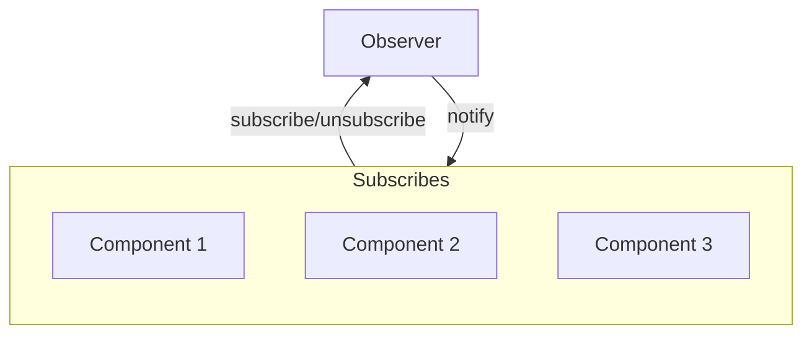

# Observer



Example:

```js
class Observable {
  constructor() {
    this.observers = [];
  }

  subscribe(callback) {
    this.observers.push(callback);
  }

  unsubscribe(callback) {
    this.observers = this.observers.filter(observer => observer !== callback);
  }

  notify(data) {
    this.observers.forEach(observer => observer(data));
  }
}
```
