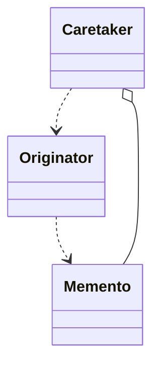

# Snapshot, Memento



## Implementation example
Pattern core classes:
```js
class Snapshot {
  data;

  constructor(data) {
    this.data = data;
  }

  getState() {
    return this.children;
  }
}

class PageBuilder {
  constructor() {
    this.children = [];
  }

  addChild(child) {
    this.children.push(child);
  }

  restore(m) {
    this.children = m.getState();
  }

  createSnapshot() {
    const clonedChildren = this.children.map((child) => (
      child.clone()
    ));

    return new Snapshot(clonedChildren);
  }

  print() {
    console.log(JSON.stringify(this.children));
  }
}

class PageBuilderHistory {
  constructor(pageBuilder) {
    this.pageBuilder = pageBuilder;
    this.snapshots = [];
  }

  saveSnapshot() {
    this.snapshots.push(this.pageBuilder.createSnapshot());
  }

  restoreLastSnapshot() {
    this.pageBuilder.restore(this.snapshots.pop());
  }
}
```
Page Builder Elements:
```js
class Picture {
  constructor(source, dimensions) {
    this.source = source;
    this.dimensions = dimensions;
  }

  setSource(source) {
    this.source = source;
  }

  clone() {
    return new Picture(this.source, this.dimensions);
  }
}

class Paragraph {
  constructor(text) {
    this.text = text;
  }

  setText(text) {
    this.text = text;
  }

  clone() {
    return new Paragraph(this.text);
  }
}
```
Usage Example:
```js
const pageBuilder = new PageBuilder();
const builderHistory = new PageBuilderHistory(pageBuilder);
const picture = new Picture("/path", [100, 200]);
const paragraph = new Paragraph("text");

pageBuilder.addChild(picture);
pageBuilder.addChild(paragraph);

builderHistory.saveSnapshot();

picture.setSource("/source");
paragraph.setText("NEW TEXT!");

pageBuilder.print();

builderHistory.restoreLastSnapshot();
pageBuilder.print();
```