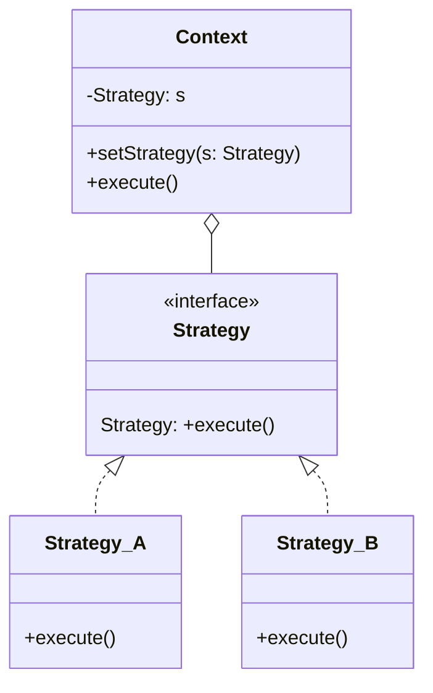

# Strategy




Strategies:
```js
class BankTransfer {
  execute(data) {
    // call bancking api
  }
}

class PaypalTransfer {
  execute(data) {
    // call PayPal api
  }
}

class CryptoTransfer {
  execute(data) {
    // call crypto wallet api
  }
}
```
Context:
```js
class Transfer {
  setStrategy(strategy) {
    this.tranferStrategy = strategy;
  }

  execute(data) {
    this.tranferStrategy.execute(data);
  }
}
```

Usage example:
```js
const transferData = {
  cardNumber: '0000 0000 0000 0000'
  cvv: '000'
  name: 'John Doe'
}; // e.g. input values from form
const transferType = 'bank'; // e.g. value received from dropdown
const transfer = new Transfer();

if (transferType === 'bank') {
  transfer.setStrategy(new BankTransfer())
} else if (transferType === 'paypal') {
  transfer.setStrategy(new PaypalTransfer())
} else if (transferType === 'crypto') {
  transfer.setStrategy(new CryptoTransfer())
}

transfer.execute(transferData)
```